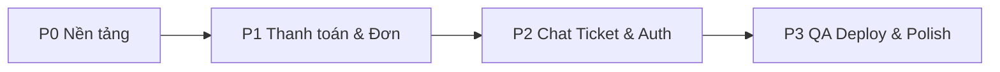

# Kế hoạch đưa PC Mall lên ~100% Production

Tài liệu này chuyển từ trạng thái **demo đồ án (~96–97%)** sang **production (~95–100%)** có thể vận hành thật.

## 1. Định nghĩa “100% production” (cho dự án này)

| Tiêu chí | Production = đạt |
|----------|------------------|
| Bảo mật | JWT refresh, rate limit, validate input, secrets không commit, HTTPS |
| Thanh toán | VNPay **live** + webhook xác nhận, idempotent |
| Vận chuyển | Ít nhất 1 carrier API thật (GHTK hoặc mock có contract rõ + webhook) |
| Chat / Ticket | Lưu DB, không mất khi restart; ticket gán người, file đính kèm (tùy chọn P2) |
| Auth | Email/password ổn định; Google OAuth thật (hoặc tắt hẳn mock) |
| Admin | Quản lý user (tạo/sửa role), giám sát đơn, audit đầy đủ |
| Vận hành | Seed/migration chuẩn, health check, logging, backup DB |
| Chất lượng | Test tự động (API + E2E smoke), CI pass, README deploy |
| UX | UI thống nhất; mobile usable; lỗi hiển thị rõ |

**Không bắt buộc cho 100% “đồ án nâng cấp”:** BI dashboard, app mobile native, multi-warehouse, marketing automation.

---

## 2. Hiện trạng (baseline)

| Lớp | Demo | Production ước lượng |
|-----|------|---------------------|
| Guest / Customer flows | ~95% | ~70–75% |
| Staff / Tech / Admin workspace | ~97% | ~75–78% |
| Tích hợp ngoài (AI, VNPay, Ship) | Mock/sandbox | ~40–50% |
| Test & CI | Placeholder | ~5% |
| DevOps / deploy | Local manual | ~20% |

**Khoảng cách cần lấp:** ~25–30% công việc có kế hoạch (ước lượng **6–10 tuần** 1 dev full-time, hoặc **3–5 tuần** 2 dev song song).

---

## 3. Lộ trình 4 phase (ưu tiên)

### Phase 0 — Nền tảng & an toàn (Tuần 1–2) — **Bắt buộc trước**

**Mục tiêu:** Môi trường deploy được, dữ liệu nhất quán, không “demo chỉ chạy máy dev”.

| # | Hạng mục | Việc cụ thể | File / khu vực |
|---|----------|-------------|----------------|
| 0.1 | **Chuẩn hóa seed** | Một script seed production: `admin@cnm.local`, `sales@cnm.local`, `tech1@cnm.local`, roles, catalog tối thiểu | `services/api/prisma/seed-production.js` |
| 0.2 | **Env & secrets** | `.env.example` đầy đủ; tách `NODE_ENV`, `FRONTEND_URL`, `JWT_*`, `VNPAY_*`, `OPENAI_API_KEY` | `services/api/.env.example`, `apps/web/.env.example` |
| 0.3 | **Refresh token** | POST `/auth/refresh`; interceptor web refresh trước khi logout | `auth.route`, `http.js`, `useAuth.js` |
| 0.4 | **Health & logging** | `/api/health` + DB ping; morgan → structured log (pino) | `server.ts`, middleware |
| 0.5 | **Dọn repo** | Di chuyển `check_*.js`, `seed_*.js` root → `scripts/` hoặc xóa; 1 SQL dump chính thức | root cleanup |
| 0.6 | **CI thật** | `npm run test:api` (supertest); smoke login + list products | `services/api`, `.github/workflows/ci.yml` |

**Done khi:** Deploy staging chạy được; đăng nhập 4 role bằng README; CI green.

**P0 đã triển khai (2026-05):** `seed-production.js`, `.env.example`, `POST /auth/refresh`, health+DB ping, `scripts/dev-tools/`, `npm run test:api`, CI MySQL+seed.

---

### Phase 1 — Thanh toán, đơn hàng, vận chuyển (Tuần 2–4) — **Doanh thu**

**Mục tiêu:** Khách trả tiền thật (hoặc sandbox VNPay chính thức), đơn đi end-to-end không mock thủ công.

| # | Hạng mục | Việc cụ thể |
|---|----------|-------------|
| 1.1 | **VNPay live** | Tích hợp IPN/webhook; verify chữ ký; map `paymentId` ↔ `orderId`; retry pay an toàn | `payments.service.js`, `orders.controller.ts` |
| 1.2 | **Trạng thái đơn** | Một nguồn sự thật: chỉ `orders.route.ts`; deprecate `orders.route.js` | `routes/index.ts` |
| 1.3 | **Shipping provider** | Interface `ShippingProvider`; impl `GhtkProvider` + giữ `MockProvider` | `shipments/providers/` |
| 1.4 | **Webhook vận đơn** | Cập nhật status SHIPPED/DELIVERED từ callback (hoặc cron poll) | `shipments`, staff UI |
| 1.5 | **Admin đơn hàng** | Trang `/admin/orders` read-only + filter (không bắt buộc sửa trạng thái) | web + `admin.route` |
| 1.6 | **Email thông báo** (P1.5) | Gửi mail đơn mới / đã ship (Resend/SMTP) | module `notifications` |

**Done khi:** Customer checkout VNPay sandbox → PAID → Staff ship → Customer thấy tracking; không duplicate payment.

---

### Phase 2 — Chat, ticket, auth nâng cao (Tuần 4–6)

**Mục tiêu:** Hỗ trợ khách và kỹ thuật không phụ thuộc file JSON / polling thô.

| # | Hạng mục | Việc cụ thể |
|---|----------|-------------|
| 2.1 | **Chat DB** | Bảng `chat_sessions`, `chat_messages`; migrate từ JSON file | Prisma/SQL + `chat.controller.ts` |
| 2.2 | **Chat realtime** | Socket.io hoặc SSE: staff + customer room | `apps/web`, `server.ts` |
| 2.3 | **Ticket** | Gán ticket cho tech khác; filter theo assignee; upload ảnh (S3/local) | tickets module |
| 2.4 | **Google OAuth** | OAuth2 thật HOẶC xóa UI mock, chỉ email/password | `RegisterPage`, `auth` |
| 2.5 | **Rate limit** | express-rate-limit trên auth, chat, ai-advisor | middleware |

**Done khi:** Restart API không mất chat; 2 tab staff thấy tin nhắn mới < 2s.

---

### Phase 3 — Admin, catalog, QA, deploy (Tuần 6–8)

| # | Hạng mục | Việc cụ thể |
|---|----------|-------------|
| 3.1 | **Admin users** | Form tạo user + đổi role (ADMIN only) | `AdminUsersPage`, `admin.route` |
| 3.2 | **Upload ảnh** | Multipart upload SP/SKU → `public/media` hoặc S3 | `admin-products`, catalog |
| 3.3 | **UI public polish** | Refactor Checkout/Profile/Cart dùng design system chung (hoặc tailwind tokens) | `apps/web` |
| 3.4 | **E2E tests** | Playwright: guest browse → register → buy → staff ship | `e2e/` |
| 3.5 | **Deploy** | Docker compose prod; nginx reverse proxy; SSL; backup MySQL cron | `docker/`, docs |
| 3.6 | **Monitoring** | Sentry frontend + API; uptime check | optional |

**Done khi:** Checklist `PRODUCTION_CHECKLIST.md` (mục 4) pass 100%.

---

## 4. Ma trận theo actor (việc còn lại)

| Actor | P0 | P1 | P2 | P3 |
|-------|----|----|----|-----|
| **Guest** | Seed ảnh/attr | — | Chat realtime | UI polish |
| **Customer** | Refresh token | VNPay live, email | Chat DB | E2E buy flow |
| **Sales** | Seed `sales@cnm.local` | Ship webhook | Chat realtime | — |
| **Tech** | Ticket stats ổn định | — | Gán ticket, file | — |
| **Admin** | Audit, metrics | Trang orders | User CRUD + role | Upload ảnh |
| **AI** | Rate limit | — | Log prompt/cost cap | — |
| **VNPay** | Env | Live + IPN | — | — |
| **Shipping** | — | Provider thật | Webhook | — |

---

## 5. Rủi ro & phụ thuộc

| Rủi ro | Giảm thiểu |
|--------|------------|
| Hai bộ route orders (TS/JS) | Chỉ giữ TS; xóa hoặc re-export JS |
| Role DB `TECHNICIAN` vs `TECH_STAFF` | Migration chuẩn hóa role names |
| Chat file `src/data/chat-sessions.json` | Phase 2 migrate trước khi scale |
| Không có test → regression | P0 bắt đầu API test; P3 E2E |
| VNPay sandbox ≠ live | Test riêng trên staging với tài khoản merchant test |

**Thứ tự cứng:** P0 → P1 (VNPay) → P2 (chat DB trước realtime) → P3.

---

## 6. Checklist “Production 100%” (ký khi go-live)

### Bảo mật & vận hành
- [ ] HTTPS, CORS đúng domain production
- [ ] JWT access + refresh, secret rotation documented
- [ ] Rate limit auth/API nhạy cảm
- [ ] Backup DB hàng ngày + restore test 1 lần

### Nghiệp vụ
- [ ] Guest: catalog + PC builder + compare
- [ ] Customer: register, profile, cart, checkout COD + VNPay, orders, cancel, warranty
- [ ] Sales: full order workflow + chat
- [ ] Tech: tickets + compatibility
- [ ] Admin: catalog CRUD, users, system settings, dashboard

### Tích hợp
- [ ] VNPay IPN xử lý PAID/FAILED
- [ ] Shipping: tạo vận đơn + tracking cập nhật
- [ ] AI Advisor: có key hoặc fallback có kiểm soát

### Chất lượng
- [ ] CI: lint + API tests + E2E smoke pass
- [ ] Không còn tài khoản demo hardcode sai README
- [ ] Runbook deploy + rollback 1 trang

---

## 7. Ưu tiên nếu thời gian hạn chế (MVP production)

Chỉ làm **12–15 mục** sau vẫn đạt ~85–90% production thực tế:

1. Seed + env chuẩn (P0.1, P0.2)
2. Refresh token (P0.3)
3. VNPay webhook (P1.1)
4. Shipping interface + mock có log (P1.3 lite)
5. Chat → MySQL (P2.1, bỏ file JSON)
6. Một bộ test API orders/auth (P0.6)
7. Docker deploy (P3.5)
8. Admin orders read-only (P1.5)
9. Dọn scripts root (P0.5)
10. Sentry hoặc log tập trung (P3.6 lite)

---

## 8. Tài liệu liên quan

| File | Mục đích |
|------|----------|
| `docs/GUEST_DEMO_100.md` | Regression guest sau mỗi phase |
| `docs/CUSTOMER_DEMO_100.md` | Regression customer |
| `docs/STAFF_DEMO_100.md` | Regression sales |
| `docs/TECH_DEMO_100.md` | Regression tech |
| `docs/ADMIN_DEMO_100.md` | Regression admin |
| `README.md` | Cập nhật khi go-live |

---

## 9. Gợi ý sprint (2 tuần / sprint)

| Sprint | Focus | % production tích lũy |
|--------|--------|------------------------|
| S1 | P0 hoàn chỉnh | ~78% |
| S2 | P1 VNPay + orders | ~85% |
| S3 | P1 shipping + admin orders | ~88% |
| S4 | P2 chat DB + ticket | ~92% |
| S5 | P2 OAuth hoặc loại mock + rate limit | ~94% |
| S6 | P3 E2E + deploy + polish | ~97–100% |

---

*Cập nhật lần đầu: theo đánh giá codebase sau hoàn thiện demo 5 actor.*
